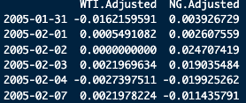
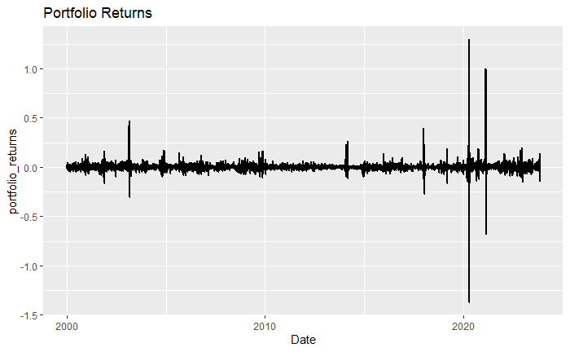
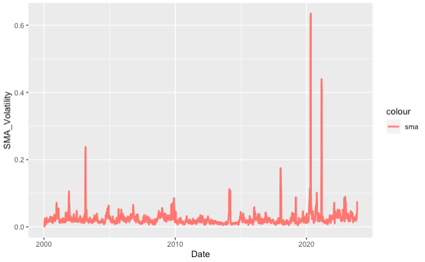
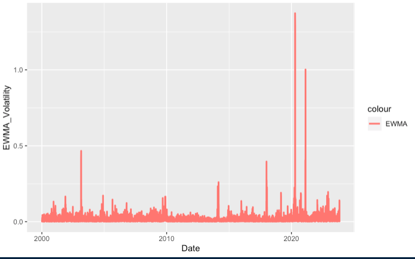
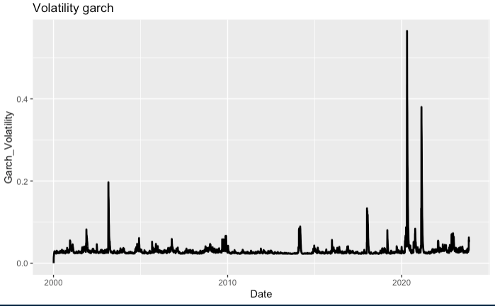
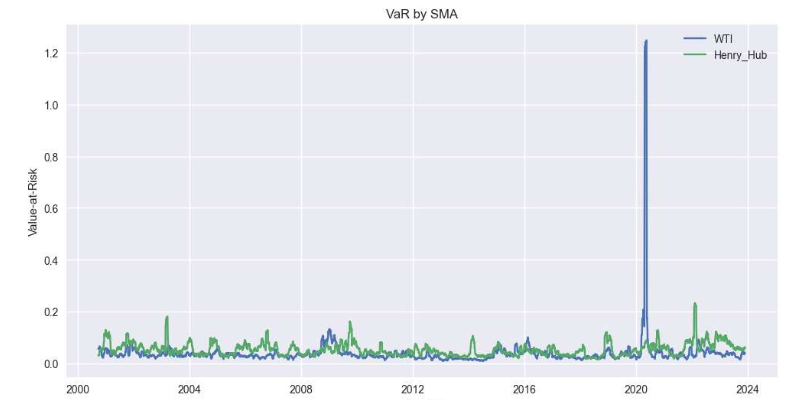
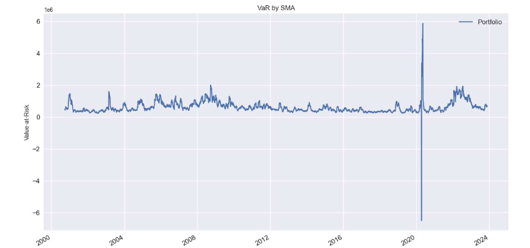
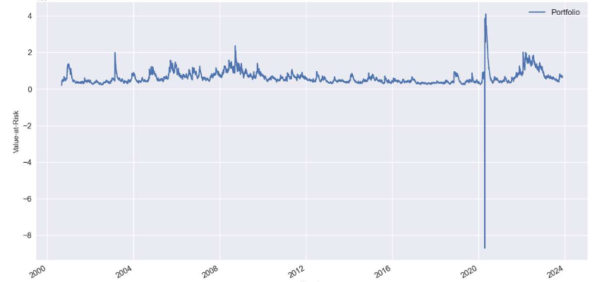
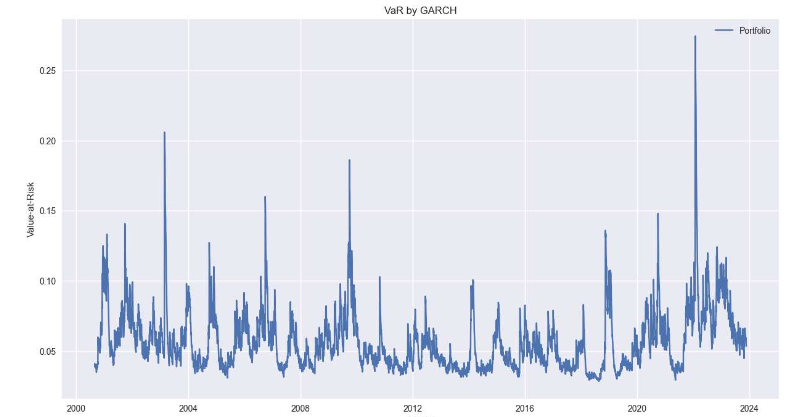
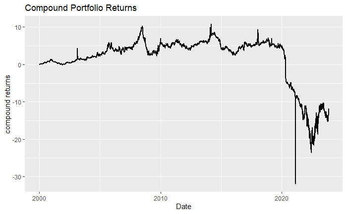

# Parametric VaR Backtesting for a Managed Futures Portfolio

This repository contains the code, report, figures, and supporting material for a final project on **parametric Value at Risk (VaR) backtesting**. The project studies a managed futures portfolio built from **WTI crude oil** and **Henry Hub natural gas** contracts with equal weights, and compares three volatility models for parametric VaR estimation: **Simple Moving Average (SMA)**, **Exponentially Weighted Moving Average (EWMA)**, and **GARCH**. The report frames VaR as a one-day downside risk measure for a portfolio with an initial value of **$10 million** and evaluates which volatility model gives the most reliable VaR forecasts and backtesting performance. 
The main conclusion of the project is that **GARCH performs best overall**, followed by **EWMA**, while **SMA** is the least adaptive to changing market conditions. The report shows this both through volatility comparisons and through backtesting results, where GARCH has the lowest RMSE and the fewest VaR violations. 

---

## Project Overview

Value at Risk (VaR) is one of the most widely used risk measures in finance. In this project, the goal is to compare **parametric VaR** under three different volatility estimation methods. The portfolio is constructed by going long or short the **second nearby contracts** of WTI and Henry Hub with equal weights. To simplify the implementation, the report uses time series with contract months in succession rather than exact rolling second nearby data. 
The project uses the standard parametric VaR setup:

1. Mark the portfolio to market at time \(V_0\)
2. Assume the one-day expected return is zero
3. Estimate one-day volatility \(\sigma_{1|0}\)
4. Compute the one-day parametric VaR under a normal return assumption

The report uses the form
\[
\hat r = -1.65 \sigma_{1|0} + \mu_{1|0},
\]
with \(\mu_{1|0}=0\), and then computes the VaR from the predicted one-day portfolio value.
---

## Motivation

Correct VaR estimation matters for financial institutions because it supports:

- capital requirement estimation
- risk management
- portfolio construction
- scenario analysis
- adaptation to market changes

These motivations are discussed in the introduction of the report and explain why comparing volatility models is important for practical risk measurement. 
---

## Research Question

The core question in this project is:

**How do SMA, EWMA, and GARCH compare when used to estimate volatility for parametric VaR and backtesting in an energy futures portfolio?** 

---

## Data

The analysis uses **WTI** and **Henry Hub** time series data downloaded from **Yahoo Finance**. The report explains that the data were arranged using contract months in succession as a practical approximation to the second nearby rolling strategy. The portfolio is then formed with equal weights in the two assets, and daily portfolio returns are computed from those series.
### Figure 1: Snapshot of data used



The first figure in the report shows a snapshot of the WTI and NG adjusted return data used in the project. It confirms the daily time-series setup used for the empirical analysis. 

### Figure 2: Portfolio daily returns



The portfolio daily returns show mostly moderate fluctuations with several large spikes, especially around 2020. This visual pattern motivates the need for volatility models that can react to changing market conditions. The chart on page 8 makes this especially clear. fileciteturn4file0L81-L81

---

## Volatility Models

The project compares three parametric volatility models.

### 1. Simple Moving Average (SMA)

SMA estimates volatility by assigning equal weight to historical returns over a fixed window. Because it weights older and newer observations equally, the report notes that it can overestimate risk and react slowly to new market conditions.

#### Figure 3: Volatility estimate using SMA



The SMA volatility series shows several spikes through time, with a particularly strong spike around 2020. The report interprets SMA as giving the highest volatility estimates among the three methods.
### 2. Exponentially Weighted Moving Average (EWMA)

EWMA places more weight on recent returns and less on older returns. This makes it more responsive to changing market conditions than SMA. In the report, EWMA is described as a middle ground between the slower SMA and the more flexible GARCH approach. 

#### Figure 4: Volatility estimate using EWMA



The EWMA volatility estimate also spikes around stressed periods, especially during 2020, but it reacts differently than SMA because of its stronger emphasis on recent observations. 

### 3. GARCH

GARCH models volatility dynamically using both past squared shocks and past conditional variances. In the report, it is presented as the most refined method of the three because it captures volatility clustering more effectively.
#### Figure 5: Volatility estimate using GARCH



The GARCH volatility plot still shows clear market stress periods, but the report notes that its estimates are lower overall than SMA and EWMA. The text on page 11 explicitly says that volatility estimates decrease from SMA to EWMA to GARCH.

---

## VaR Results

After estimating volatility with each method, the project computes VaR for the individual assets and for the equal-weight portfolio.

### Figure 6: VaR for individual assets



The individual-asset VaR plot shows that **WTI has a higher VaR than Henry Hub**, which the report attributes to WTI’s higher volatility. 
### Figure 7: Portfolio VaR using SMA



Under SMA, the portfolio VaR appears fairly stable most of the time but shows a major spike around the 2020 period. The report describes SMA as relatively stable but sometimes not responsive enough. 
### Figure 8: Portfolio VaR using EWMA



The EWMA portfolio VaR is more responsive to recent volatility shocks and shows a different pattern around stressed periods than SMA. The report notes that its spike is less dramatic than SMA’s because of the model’s structure. 
### Figure 9: Portfolio VaR using GARCH



The GARCH portfolio VaR is smoother in some periods but still reacts to market stress. The report concludes that GARCH gives the best predictive performance overall, with the fewest backtesting violations. 

---

## Model Comparison and Interpretation

The report compares the three volatility models from both a volatility-estimation and VaR-backtesting perspective.

Main findings:

- **SMA** gives the highest volatility estimates and may overestimate risk
- **EWMA** is more sensitive to recent information than SMA
- **GARCH** gives the lowest volatility estimates of the three and performs best in prediction
- **WTI VaR** is higher than **Henry Hub VaR** because WTI is more volatile
- **GARCH** has the lowest RMSE
- **GARCH** has the fewest VaR backtesting violations
- **EWMA** ranks second
- **SMA** ranks third

These conclusions are stated directly in the results and conclusion sections of the report. 
---

## Portfolio Performance

### Figure 10: Long portfolio performance



The compound return plot shows the long-run performance of the managed portfolio. The report states that a managed fund starting with **$10M** and staying long this portfolio would have declined by about **10%** over the sample period. The plot also shows a severe drawdown around 2020.

## Repository Structure

A clean organization for this repository is:

```text
.
├── README.md
├── data/
├── R/
├── figures/
│   ├── figure_01_snapshot_of_data_used.png
│   ├── figure_02_portfolio_daily_returns.png
│   ├── figure_03_volatility_estimate_using_sma.png
│   ├── figure_04_volatility_estimate_using_ewma.png
│   ├── figure_05_volatility_estimate_using_garch.png
│   ├── figure_06_var_for_individual_assets.png
│   ├── figure_07_portfolio_var_using_sma.png
│   ├── figure_08_portfolio_var_using_ewma.png
│   ├── figure_09_portfolio_var_using_garch.png
│   └── figure_10_long_portfolio_performance.png
├── results/
└── report/
    └── STAT_649_Report.pdf
```

Suggested use:
- `data/` for WTI and Henry Hub raw or cleaned data
- `R/` for scripts used to compute returns, volatility, VaR, and backtesting
- `figures/` for all extracted report figures
- `results/` for generated output tables and summaries
- `report/` for the final report PDF

---

## How to Run the Project

1. Prepare the WTI and Henry Hub data
2. Compute equal-weight portfolio returns
3. Estimate volatility using:
   - SMA
   - EWMA
   - GARCH
4. Compute one-day parametric VaR
5. Run backtesting and compare violations
6. Reproduce the figures and performance summaries

If your code is in R or R Markdown, a typical structure would be to keep:
- scripts in `R/`
- plots in `figures/`
- final outputs in `results/`

---

## Conclusion

The final conclusion of the report is that **GARCH outperforms SMA and EWMA** in this application. It provides the strongest predictive accuracy and the best VaR backtesting performance, making it the most suitable of the three models for this managed futures portfolio. EWMA performs better than SMA but still falls short of GARCH. The report suggests that future work could improve the study by using exact second nearby data and by exploring more advanced models such as **FIGARCH** or **HYGARCH**.
---

## Authors

- Arthur Steve Tchonetek
- Arnold Muchatibaya
  
---

## References

The report cites the following key sources:

- JP Morgan and Reuters, *Risk Metrics*
- John C. Hull, *Options, Futures, and Other Derivatives*
- Deepak Jadhav and T.V. Ramanathan on parametric and non-parametric VaR
- Escanciano and Olmo on backtesting parametric VaR
- Mabrouk and Saadi on parametric VaR analysis
